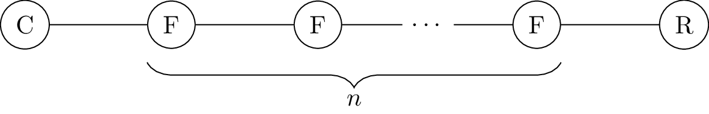
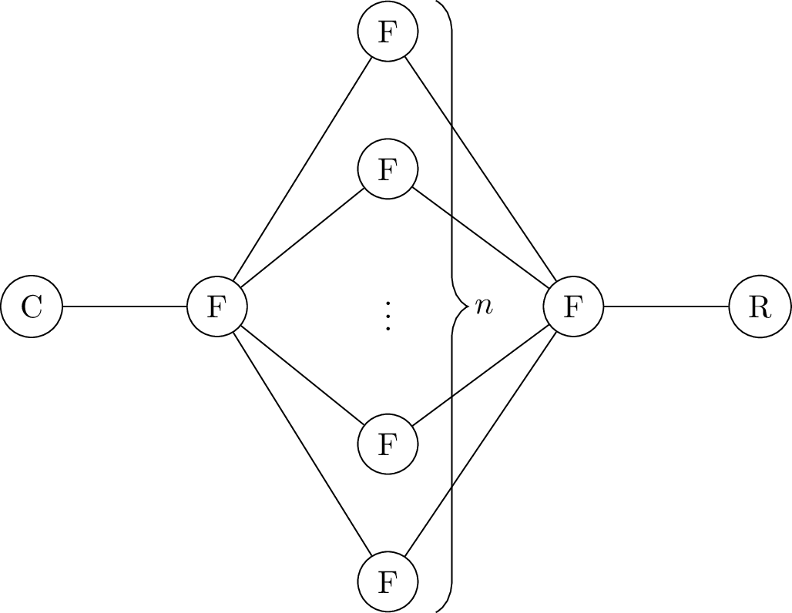
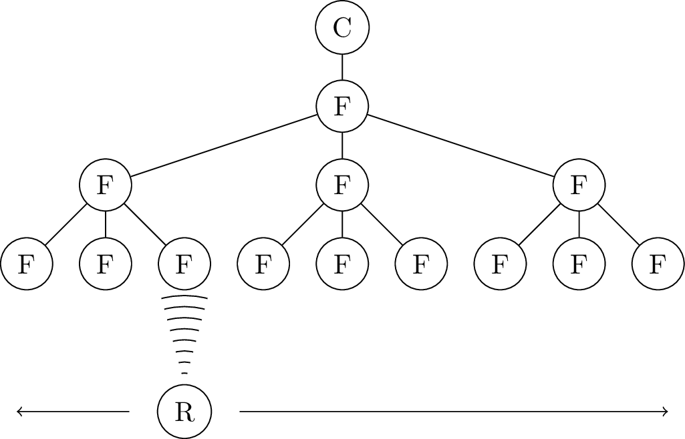

# PiCN Routing Performance Measurement

A small collection of performance tests for routing in [s3lph/picn][s3lph-picn].

## Usage

### With Docker

```sh
mkdir raw
mkdir plots
docker build .
docker run -d -v $(realpath raw):/raw -v $(realpath plots):/plots <image id>
```

### Without Docker

Dependencies:

  - git
  - bc
  - Python >= 3.6
  - pip
  - Matplotlib

```sh
./setup.sh
./run.sh
```

## Results

The files produced by each run are tagged with the UNIX timestamp of the start of
the run (in UTC) to avoid overwriting results from previous runs.  For each test
case, a CSV file is created in `raw/`.  The raw data is of the form

```csv
param1,param2,...,paramN,result1,...,resultN
```

where `param1` to `paramN` are testcase-specific parameters (see below), and
`result1` to `resultN` are the results for the test case.

Plots generated from the raw CSV data are placed in `plots/`.  The filenames
contain the timestamp, the name of the test case, and the parameters that
remain constant in the plot.

## Test Cases

### `depth`

#### Test Setup



The forwarders are started from left to right to enforce the worst-case alignment of
routing 

#### Parameters

1. `n` - The number of forwarders between client and repo
2. `interval` - The routing information exchange interval, in seconds

#### Result

1. Time in seconds until an interest from the client was served by the repo.
2. `ok` if the content was received, `fail` if the interest timed out.

#### Plots

For each routing interval  in `0.5, 1.0, 2.0`, there is one plot describing the
time until the client was able to fetch data from the repo, depending on the
number of forwarders in between.

### `breadth`

#### Test Setup



#### Parameters

1. `n` - The number of forwarders in the middle layer
2. `interval` - The routing information exchange interval, in seconds

#### Result

1. Time in seconds until an interest from the client was served by the repo.
2. `ok` if the content was received, `fail` if the interest timed out.

#### Plots

For each routing interval  in `0.5, 1.0, 2.0`, there is one plot describing the
time until the client was able to fetch data from the repo, depending on the
number of forwarders in the middle layer.

### `depth_rand`

Like `depth`, but with randomized starting order of forwarders and a small
randomzied delay between starting the forwarders.

### `breadth_rand`

Like `breadth`, but with randomized starting order of forwarders and a small
randomzied delay between starting the forwarders.

### `repo_hopping`

#### Test Setup



This test case simulates a mobile repository that "hops" from one edge forwarder
to the next, each time registering with the prefix `/edge/hoppingrepo`.  The
client attempts to fetch data from the repository every 0.1s for one minute (600
in total), which may fail if the network is not yet aware that the repository has
moved to another forwarder.

#### Parameters

1. `routing_interval` Interval of routing information propagation between
    forwarders, in seconds.
2. `hopping_interval` Time until the repo moves to another forwarder, in seconds.
3. `lease_time` Duration for autoconfig service registration leases, in seconds.

#### Results

1. Ratio of interests that was satisfied (excluding packets that arrived out-of-order).
2. Ratio of interests that was satisfied (including packets that arrived out-of-order).
3. Average round trip time from sending the interest to receiving the content (including
    packets that arrived out-of-order).

#### Plots

TBD

### `repo_hopping_edge_traverse`

Like `repo_hopping`, but additionally, each forwarder has FIB entries for `/edge`, which
point to all directly connected forwarders on a lower layer. 

[s3lph-picn]: https://github.com/s3lph/picn
